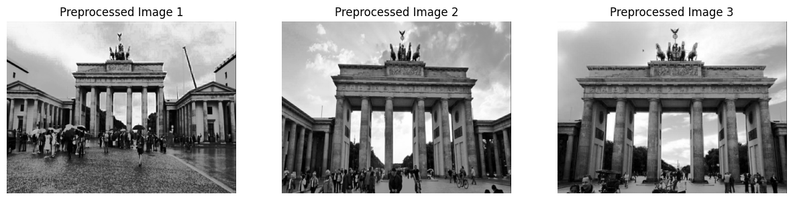
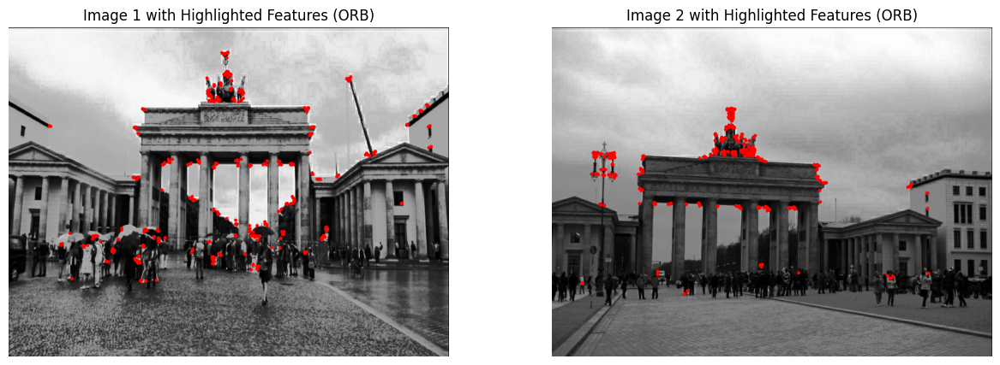
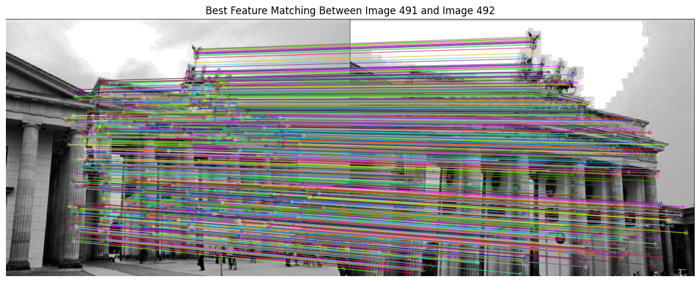

# 🏛️ 3D Landmark Reconstruction and Mobile Visualization
*A Computer Vision Project using ORB, Fundamental Matrix Estimation, Triangulation & Mobile Deployment*

This repository presents an end-to-end pipeline for reconstructing a 3D model of the **Brandenburg Gate** from 2D images using classical computer vision techniques. The model is later deployed in a mobile interface using **FlutterCube** for real-time 3D interaction.

> 🧠 **Course**: CS436 - Computer Vision  
> 🗓️ **Semester**: Fall 2024  
> 🏫 **Institution**: LUMS  
> 👨‍💻 Contributors: Muhammad Saad Haroon, Zammad Bin Ziyad Khan

---

## 🧠 Project Overview
This project focuses on multi-view 3D reconstruction of a real-world landmark using feature-based methods, geometric modeling, and sparse point triangulation. Our final output is a usable 3D model that is deployed and visualized using FlutterCube.

---

## 📁 Directory Structure
```
3D-Landmark-Reconstruction-CV/
│
├── notebooks/                     # Jupyter notebooks for feature matching and triangulation
│   ├── G02_Deliverable1.ipynb
│   └── G02_Deliverable2.ipynb
│
├── app_code/                     # FlutterCube mobile deployment code
│
├── images/                       # Visual outputs from preprocessing and feature matching
│   ├── Preprocessed_Images.png
│   ├── feature_detection.png
│   └── feature_matching.png
│
├── models/                       # 3D reconstructed model files
│   └── landmark_model.glb
│
├── dataset/                      # Filtered input images
│   └── SelectedImages/
│
├── report/                       # Final write-up
│   └── G02_Report_Final.pdf
│
├── README.md                     # This documentation file
```

---

## 🎓 Methodology

### 1. 📸 Dataset Preparation
- ~1400 raw images were collected of the **Brandenburg Gate**.
- Manually filtered to 500 high-quality front and angular views.
- Images were then:
  - Resized
  - Converted to grayscale
  - Histogram equalized for contrast improvement



---

### 2. 🔍 Feature Detection with ORB
ORB was chosen for its computational efficiency and rotation invariance.
- Detected keypoints across pairs of images
- Used `cv2.ORB_create()` followed by Brute-Force Hamming Matcher
- Filtered matches using Lowe’s Ratio Test + RANSAC for stability



---

### 3. 🔗 Feature Matching
- Best matches across consecutive views visualized
- Ensured correspondences for epipolar geometry



---

### 4. 📷 Camera Pose Estimation
- Intrinsic parameters extracted from COLMAP’s `cameras.bin`
- Fundamental and essential matrix computed
- Pose recovered using `cv2.recoverPose()`

---

### 5. 📐 Linear Triangulation
- Projection matrices created from pose and intrinsics
- 3D points triangulated using `cv2.triangulatePoints`
- Points converted to Euclidean by dividing by homogeneous coordinate

---

### 6. 🧊 Mesh Generation
- Triangulated points imported to Open3D
- Normals estimated and smoothed
- Poisson mesh reconstruction applied
- Output exported as `.glb` (also supported: `.obj`)

---

### 7. 📱 Mobile Deployment
- Final mesh rendered in a Flutter app using [`flutter_cube`](https://pub.dev/packages/flutter_cube)
- Device used: POCO X3 GT (non-ARCore supported)
- Interactive: rotate, zoom, and inspect 3D model

---

## ✅ Results Summary

| Step                  | Outcome                             |
|-----------------------|-------------------------------------|
| Image Preprocessing   | Contrast-enhanced grayscale views  |
| ORB Detection         | Reliable features per image         |
| Matching              | 80–100 strong matches per pair      |
| Triangulation         | Sparse 3D cloud preserved structure |
| Mesh Reconstruction   | Usable mesh from sparse points      |
| Mobile App            | Model viewable in 3D, interactively |

---

## 🚧 Challenges Encountered
- Lack of ARCore support → switched to FlutterCube
- Sparse image overlap → limited dense reconstruction
- Some mesh artifacts → could benefit from dense stereo or MVS

---

## 🛠 Future Work
- Replace ORB with SuperPoint + SuperGlue for more robust features
- Integrate MVS for dense reconstruction
- Deploy on ARCore-enabled phones for live projection
- Add texture mapping from source images
- Evaluate point cloud fidelity using SSIM or IoU

---

## 📄 Citation
If you reference this project or build upon it:
```bibtex
@project{3DLandmarkCV2025,
  author = {Muhammad Saad Haroon and Zammad Bin Ziyad Khan},
  title = {3D Landmark Reconstruction and Mobile Visualization},
  note = {Developed as part of CS436: Computer Vision course at LUMS, Spring 2025.}
}
```

---


> “To reconstruct a monument is to capture time, geometry, and memory—one feature at a time.”
